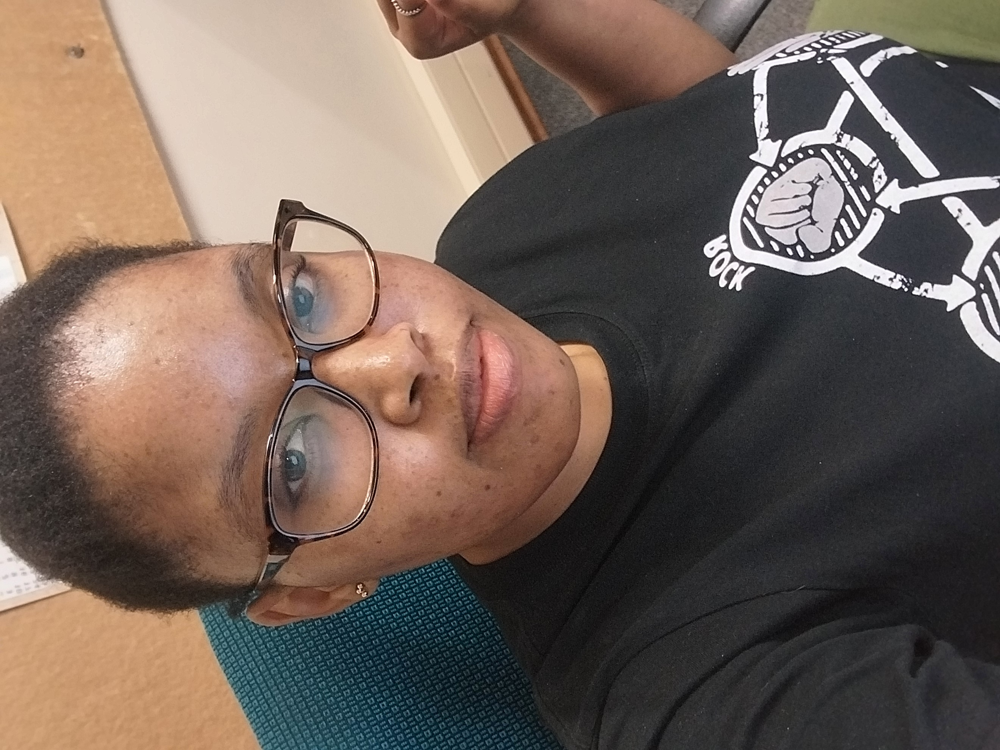

# Mmathapelo Matsobe

  

## About me
I am a BSc graduate in Statistics and Mathematics from North-West University. Although it took me longer than expected to complete my degree, I persevered and successfully graduated.

During my high school years, I was uncertain about my career path. I knew I was good at Mathematics and Science, and I believed in my intelligence and ability to achieve anything I set my mind to. However, I later realised that intelligence alone is not enough, it must be accompanied by discipline and determination. I often relied too heavily on my natural ability rather than seeking help when needed, which ultimately hindered my progress.

In Grade 12, I lacked the motivation to strive for distinctions. I did the bare minimum to pass and never truly learned how to study with purpose or long-term goals. I explored many possible careers, including Chemical Engineering, Physical Science, and Dermatology. My interest in dermatology was personal, as I struggled with acne and hoped to find solutions for it. At some point, my mother suggested Actuarial Science. Initially unfamiliar with it, I researched the field and became interested. I applied for various programmes not necessarily out of passion, but because I believed I was capable of succeeding in any of them. Unfortunately, I was not accepted into any Actuarial Science programmes due to my grades. This should have been a turning point for me to recognise the need for support and growth, but I entered university with the same mindset. In 2014, I enrolled in an extended BSc Mathematical Sciences programme at the University of Pretoria. While I progressed academically at first, I struggled with discipline and focus.

University life introduced me to independence, but I mismanaged it. I often skipped classes and spent time studying topics unrelated to my coursework. Although I enjoyed learning, especially in areas like literature and science, this lack of structure negatively affected my performance. Over time, my academic standing deteriorated, and I became increasingly overwhelmed and unfocused.
I attempted to pursue Actuarial Science modules but did not pass them. I eventually deregistered from several courses and was excluded from the University of Pretoria at the end of 2016. I received the official notice in early 2017. This was a difficult moment for me, as I had hoped to make a fresh start that year.
Despite my setbacks, my parents continued to support and believe in me. They encouraged me to continue my education rather than give up. With their support, I was admitted into the BSc Statistics and Mathematics programme at North-West University in 2017.
However, my challenges persisted. I continued to struggle academically—not due to a lack of effort, but because I later discovered that I was dealing with Attention Deficit Hyperactivity Disorder (ADHD). This significantly affected my ability to focus, prioritise, and manage my studies effectively. I often studied, but not always the material I was supposed to focus on.
After several years of repetition and perseverance, I finally graduated in October 2022. While I felt proud of my achievement, I also recognised that I could have performed better with the right support and self-awareness.
It was only after graduating that I truly discovered my passion. I developed a strong interest in working with data and programming, which led me to pursue Data Science.
To build my skills, I enrolled in the IBM Data Science Professional Certificate on Coursera. Although I initially paused due to financial constraints, I later resumed and completed the programme in June 2025 after securing a position as an Administrative Assistant at North-West University.
I also enrolled in a Data Science programme with ALX Africa, which further strengthened my skills and confirmed my passion. During this journey, I embraced my ADHD and developed strategies to manage it effectively. This self-awareness has significantly improved my focus, productivity, and confidence.
Additionally, completing the programme alongside my sister taught me the importance of teamwork and support systems. I now understand that success is not achieved in isolation—collaboration and support are essential.
Today, I am confident in my abilities as a data science professional. I am passionate about learning, solving problems, and contributing meaningfully to a team. I believe that my journey has built resilience, adaptability, and determination, and I am ready to bring these strengths into my career.

# BSc Statistics and Mathematics projects
